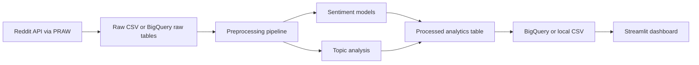

# Indian Government Sentiment Analysis Dashboard

An end-to-end portfolio project for collecting India-focused Reddit discussions, cleaning text, running sentiment analysis, extracting topics, storing analytics, and presenting insights in a Streamlit dashboard.

The project runs locally with bundled sample data, so it can be demonstrated before Reddit API and BigQuery credentials are configured.

## Features

- Reddit ingestion with PRAW for posts and comments
- Reusable text preprocessing pipeline
- Baseline sentiment labeling plus scikit-learn model training utilities
- Naive Bayes and Logistic Regression comparison support
- Transformer inference hook for DistilBERT or BERT via Hugging Face
- TF-IDF keyword extraction and LDA topic modeling
- BigQuery-ready schema and upload adapter
- Streamlit dashboard with KPI cards, distribution charts, timelines, word clouds, topics, and explorer filters
- Docker and Render deployment configuration

## Architecture



## Project Structure

```text
data/
  raw/
  processed/
  external/
src/
  data_collection/
  preprocessing/
  feature_engineering/
  models/
  database/
  analytics/
  utils/
dashboard/
  components/
  assets/
deployment/
tests/
config/
models/
reports/
```

## Quick Start

```bash
python3 -m venv .venv
source .venv/bin/activate
pip install -r requirements.txt
python main.py
streamlit run dashboard/app.py
```

The first `python main.py` run creates:

- `data/raw/reddit_posts_sample.csv`
- `data/raw/reddit_comments_sample.csv`
- `data/processed/sentiment_content.csv`

## Environment Variables

Copy `.env.example` to `.env` and fill values when you are ready to collect live data or upload to BigQuery.

```bash
cp .env.example .env
```

Required for Reddit ingestion:

- `REDDIT_CLIENT_ID`
- `REDDIT_CLIENT_SECRET`
- `REDDIT_USER_AGENT`

Required for BigQuery:

- `GCP_PROJECT_ID`
- `BIGQUERY_DATASET`
- `GOOGLE_APPLICATION_CREDENTIALS`

## Run Tests

```bash
pytest
```

## Deployment

Build locally:

```bash
docker build -f deployment/Dockerfile -t india-gov-sentiment .
docker run -p 8501:8501 india-gov-sentiment
```

Render can use `deployment/render.yaml`. Streamlit Cloud can run `dashboard/app.py` directly after installing `requirements.txt`.

