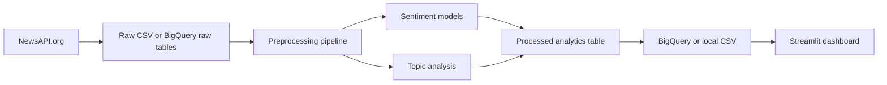

# Indian Government Sentiment Analysis Dashboard

An end-to-end portfolio project for collecting India-focused news articles, cleaning text, running sentiment analysis, extracting topics, storing analytics, and presenting insights in a Streamlit dashboard.

**Note:** Migrated from Reddit API to **NewsAPI.org** for more reliable real-time data collection.

## Features

- **NewsAPI ingestion** for real-time news articles on government topics
- Reusable text preprocessing pipeline
- Baseline sentiment labeling plus scikit-learn model training utilities
- Naive Bayes and Logistic Regression comparison support
- Transformer inference hook for DistilBERT or BERT via Hugging Face
- TF-IDF keyword extraction and LDA topic modeling
- BigQuery-ready schema and upload adapter
- Streamlit dashboard with KPI cards, distribution charts, timelines, word clouds, topics, and explorer filters
- Docker and Render deployment configuration

## Architecture



## Project Structure

```text
data/
  raw/
  processed/
src/
  data_collection/
    newsapi_client.py          # NewsAPI client (replaces reddit_client.py)
  preprocessing/
  feature_engineering/
  models/
    realtime_news_analyzer.py  # NewsAPI realtime analyzer (new)
  database/
  analytics/
  utils/
dashboard/
  components/
  assets/
deployment/
tests/
config/
models/
reports/
```

## Quick Start

```bash
python3 -m venv .venv
source .venv/bin/activate
pip install -r requirements.txt

# Set your NewsAPI key
export NEWSAPI_KEY="your_key_here"

# Run main analysis
python main.py

# Run real-time sentiment analysis
python realtime_analysis.py --mode recent

# View dashboard
streamlit run dashboard/app.py
```

## Environment Variables

Copy `.env.example` to `.env` and fill values when you are ready to collect live data or upload to BigQuery.

```bash
cp .env.example .env
```

**Required for real-time news analysis:**

- `NEWSAPI_KEY` - Get free key from https://newsapi.org/register

**Optional for BigQuery:**

- `GCP_PROJECT_ID`
- `BIGQUERY_DATASET`
- `GOOGLE_APPLICATION_CREDENTIALS`


## Run Tests

```bash
pytest
```

## Real-Time Sentiment Analysis

Analyze recent news articles in real-time:

```bash
# Basic usage with default government-related queries
python realtime_analysis.py --mode recent

# Custom search queries
python realtime_analysis.py --mode recent --queries "election" "budget" "parliament"

# Use different model
python realtime_analysis.py --mode recent --model naive_bayes

# Continuous stream updates
python realtime_analysis.py --mode stream
```

See [REALTIME_GUIDE.md](REALTIME_GUIDE.md) for detailed real-time analysis documentation.

## Deployment

Build locally:

```bash
docker build -f deployment/Dockerfile -t india-gov-sentiment .
docker run -p 8501:8501 -e NEWSAPI_KEY="your_key" india-gov-sentiment
```

Render can use `deployment/render.yaml`. Streamlit Cloud can run `dashboard/app.py` directly after installing `requirements.txt` and setting `NEWSAPI_KEY` environment variable.

## Interview Talking Points

- Why the pipeline separates raw, processed, and aggregated data
- How model comparison expands from lexicon baseline to traditional ML and transformer inference
- How switching from Reddit to NewsAPI improves data quality and reliability
- How BigQuery tables are designed for scalable analytics
- How the dashboard supports analyst workflows through filters and drill-down exploration
- What changes are needed for scheduled real-time ingestion

## Migration Notes: Reddit → NewsAPI

Previously, this project collected data from Reddit using PRAW. The project has been migrated to **NewsAPI.org** for the following reasons:

- **Cost:** Reddit API is now restricted; NewsAPI offers a free tier (100 requests/day)
- **Quality:** Professional news sources vs. user-generated content
- **Reliability:** Stable, well-maintained API vs. declining Reddit support
- **Setup:** Single API key vs. three Reddit credentials
- **Coverage:** Global news sources with India-specific filters

### Files Changed:

- `src/data_collection/newsapi_client.py` (new)
- `src/models/realtime_news_analyzer.py` (new, replaces `realtime_analyzer.py`)
- `realtime_analysis.py` (updated for NewsAPI)
- `config/settings.yaml` (updated configuration)
- `requirements.txt` (removed praw, added requests)
- `REALTIME_GUIDE.md` (updated documentation)

## Real-Time Data Training Pipeline

Complete end-to-end pipeline for collecting and retraining models with real-time data:

- **collect_training_data.py** - Fetch articles and combine datasets
- **label_articles.py** - Assist with sentiment labeling and pre-labeling
- **retrain_models.py** - Retrain models with expanded datasets
- **TRAINING_COMPLETE.md** - Full documentation and workflow guide
- **DATA_COLLECTION_GUIDE.md** - Detailed labeling instructions
- **QUICK_START_TRAINING.md** - Quick reference and expected improvements

See documentation files for complete setup and usage instructions.
